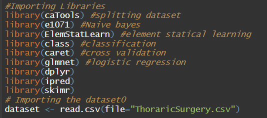
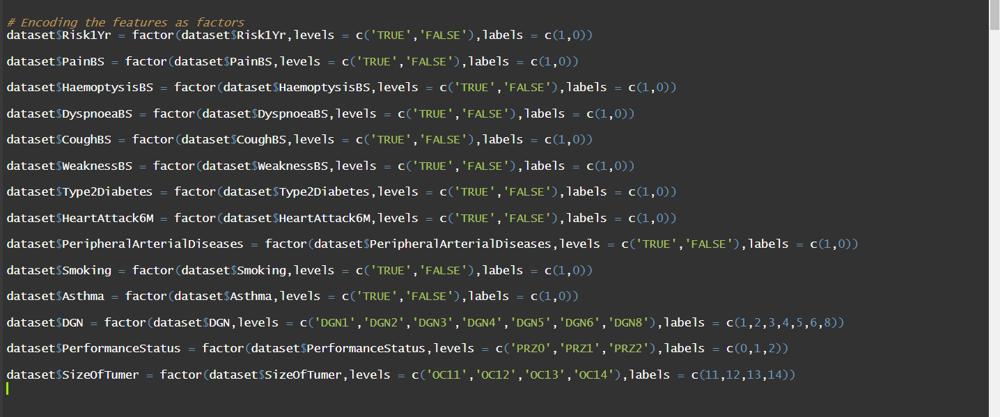
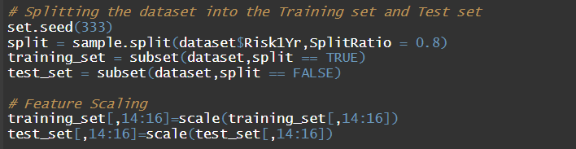
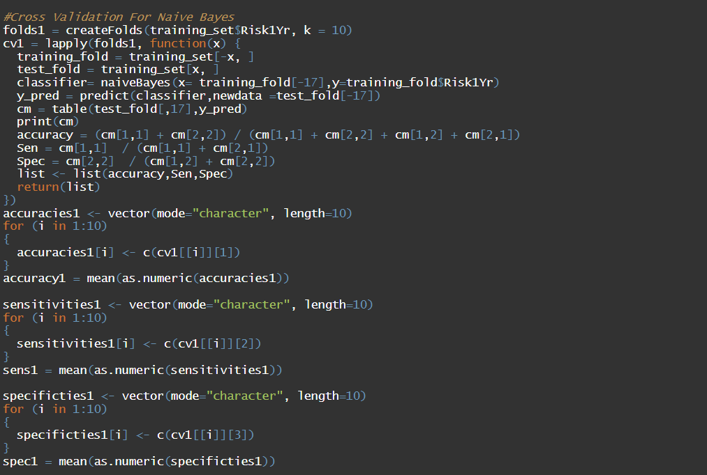
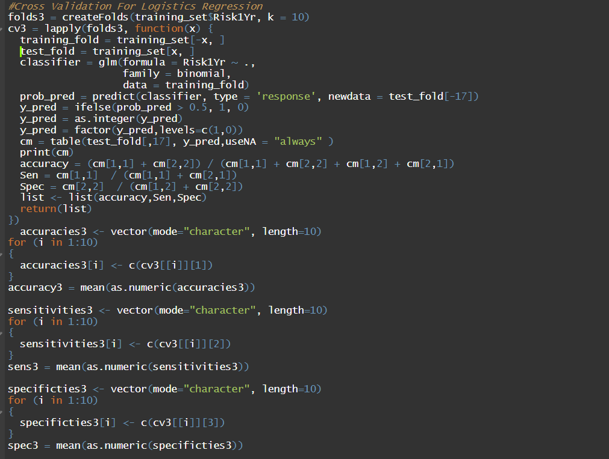
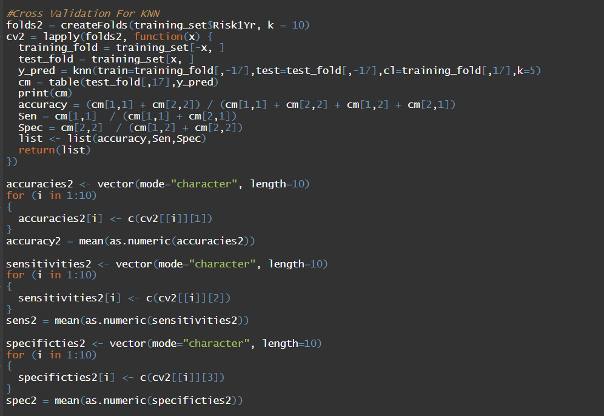
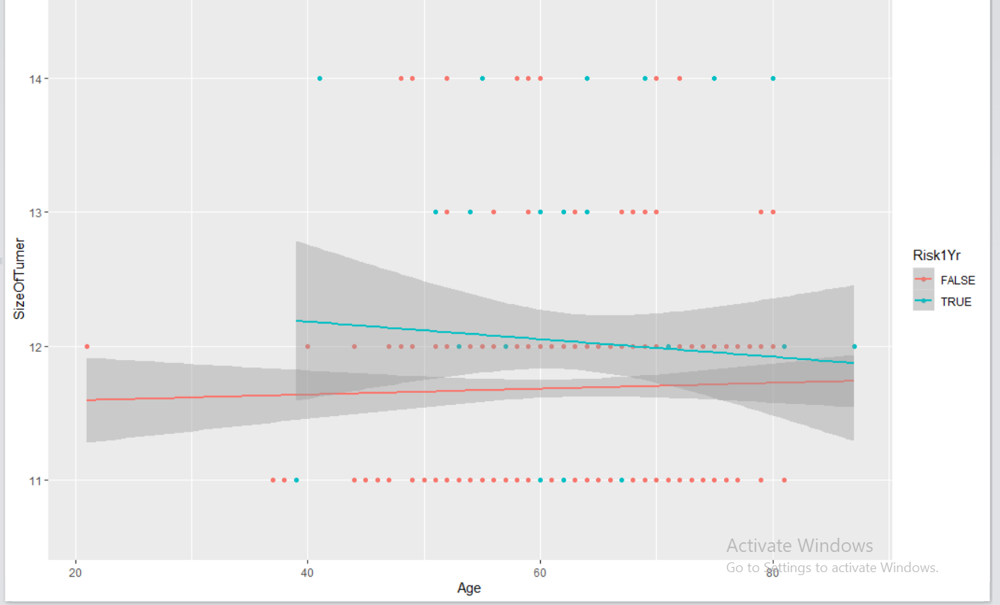

 <h1> Thoracic Surgery</h1> 

# Introduction to Thoracic Surgery:
>Thoracic surgery as its evolving and surgeons have major collaborative roles in management of lung cancer, respiratory infections, chest trauma, pediatric respiratory disorders and end-stage respiratory. Today, lung cancer is the most frequent indication for thoracic surgery. Thoracic Surgeries focuses on the chest organs, including the esophegus , trachea , pleura , chest wall, diaphragm, heart, and lungs. Technological advances have increased the safety and availability of these complex surgical procedures. Lung cancer surgeries and anti-reflex surgeries save and improve lives around the world. The most common diseases requiring thoracic surgery include lung cancer, chest trauma (require urgent thoracic surgery), esophageal cancer, emphysema and lung transplantation.
# Dataset Information:
>The data was collected retrospectively at Wroclaw Thoracic Surgery Centre for patients who underwent major lung resections for primary lung cancer in the years 2007 & 2011. 
## Attributes: 
>We have 17 attributes in our dataset classified to:
* Diagnosis. 
* Forced Vital Capacity.
* Forced Expiratory Volume.
* Performance Status.
* Pain Before Surgery. 
* Haemoptysis Before Surgery.
* Dyspnoea Before Surgery. 
* Cough Before Surgery. 
* Weakness Before Sugery. 
* Size Of Tumer.
* Type 2 Diabetes. 
* Heart Attack 6M. 
* Peripheral Arterial Diseases.
* Smoking (T,F).
* Asthma (T,F).
* Age.
* Risk 1 Year.
# R-Programming Language:
>R is a clear and accessible programming tool. R includes machine learning algorithm, linear regression, time series, statistical inference to name a few.
# Methods Used:
## Naive Bayes:
>Naive Bayes is a classification algorithm for binary (two-class) and multiclass classification problems. The technique is easiest to understand when described using binary or categorical input values.
### Advantages of Naive Bayes:
1. When assumption of independent predictors holds true, a Naive Bayes
classifier performs better as compared to other models.
2. Naive Bayes requires a small amount of training data to estimate the
test data. So, the training period is less.
3. Naive Bayes is also easy to implement.

## Logistic Regression:
>Logistic regression is a technique borrowed by machine learning from the
field of statistics.
### Advantages of Logistic regression:
1. Very efficient.
2. Doesn’t require too many resources.
3. Easy to regularize.
4. Easy to implement.
## K-nearest Neighbors (KNN) Mode:
>KNN is an algorithm that is considered both non-parametric and an example of lazy learning.
### Advantages of KNN:
1. Very simple implementation.
2. Classifier can be updated online at very little cost as new instances with known classes are presented.
3. Few parameters to tune: distance metric and k.
## Data Pre-proccessing:
>In our data we have three scale variables and thirteen nominal variables,So we need to determine the correlation between the scale and nominal variables and the one-year status.We will use two types of relations. The ANOVA test between the one-year status and scale variables while the chi-square between one-year status and the nominal variables.
>We won’t do any data imputation in our statistical model
because our dataset is complete and doesn’t have any missing values in them.
# Thoracic Surgery by Machine Learning:
## Importing Libraries ana Dataset in R:

## Encoding Features:

### Splitting Data and Feature Scalling:

## Cross Validation For Naive Bayes:

### Results Obtained: 

## Cross Validation For Logistic Regression:

 ### Results Obtained: 

## Cross Validation For KNN:

### Results obtained: 

## Visualization of Data:
By applying t-test , we selected the most effective features on Risk 1 Year feature. We found that Age and Size of tumer are the most effective features. 

# Team Members:
| Name | Website |
| ----------- | ----------- |
| Asmaa Mahmoud Mahmoud | [Asmaa Mahmoud ](https://asmaamahmoud12.github.io/Asmaa-Mahmoud/) |
| Alaa Gamal AbdelAziz |  [Alaa Gamal ](https://alaagamal98.github.io/AlaaGamal/) |
| Salma Mohamed Zakaria |  [Salma Zakaria ](https://salmazakariia.github.io/Salma-Zakaria/) |
| Marwa Adel Youssef  |  [Marwa Youssef ](https://marwaayosiif.github.io/MarwaYoussef/) |
